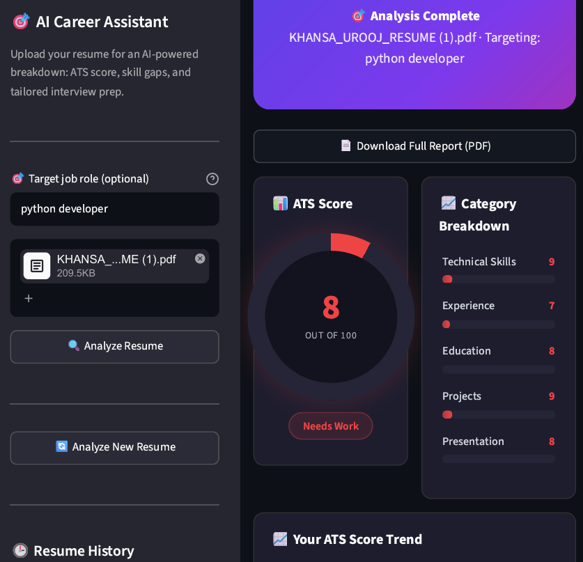

# 🎯 AI Career Assistant

An AI-powered resume analyzer that gives you a recruiter-grade breakdown of your resume — ATS scoring, skill-gap detection, tailored interview prep, and a downloadable PDF report — all generated in seconds.



## 🚀 Live Demo
[Try it here](https://ai-career-assistant-czmxu7w4z8jnrn5ja4hyr9.streamlit.app/)

## ✨ Features
- 📄 PDF resume upload with automatic text extraction
- 🎯 Job-role targeting — tailor analysis to a specific role you're applying for
- 📊 Custom animated ATS score ring (0–100)
- 📈 Category breakdown (technical skills, experience, education, projects, presentation) as animated progress bars
- 📉 ATS score trend chart across multiple resume versions
- 🕒 Resume history — revisit and compare past analyses
- 🎤 Personalized interview questions (HR, technical, coding)
- 📥 One-click downloadable PDF report of the full analysis
- 🎨 Custom-styled dark UI — no default chart-library look

## 🏗️ ArchitectureResume PDF → Text Extraction (PyMuPDF) → Prompt-Engineered LLM Call (Groq / Llama 3.3)
↓
Structured JSON (scores, skills, questions)
↓
Custom HTML/CSS Dashboard + PDF Report Export

## 🛠️ Tech Stack
| Component | Tool |
|---|---|
| PDF Parsing | PyMuPDF |
| LLM | Groq API (Llama 3.3 70B) |
| Frontend | Streamlit + custom CSS |
| Charts | Plotly (trend chart) + custom CSS (score ring, category bars) |
| PDF Export | fpdf2 |

## ⚙️ Setup

```bash
git clone https://github.com/khansaurooj/ai-career-assistant.git
cd ai-career-assistant
pip install -r requirements.txt
```

Create a `.env` file or set the environment variable:
GROQ_API_KEY=your_groq_api_key_here

Run the app:
```bash
streamlit run app.py
```

## 🎯 What This Project Demonstrates
- Prompt engineering for structured, reliable JSON output from an LLM
- Building custom data visualizations without relying on default chart-library styling
- Handling AI-generated content safely (HTML escaping to prevent injection/layout breaks)
- Persistent local history and stateful multi-step user flows in Streamlit
- PDF generation and export from dynamic AI-generated content

## 📄 License
MIT
